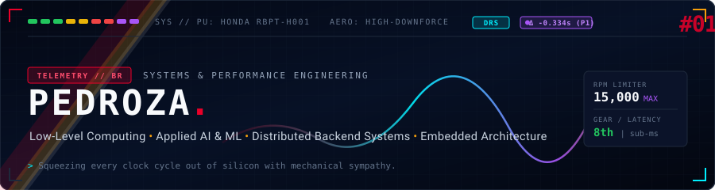
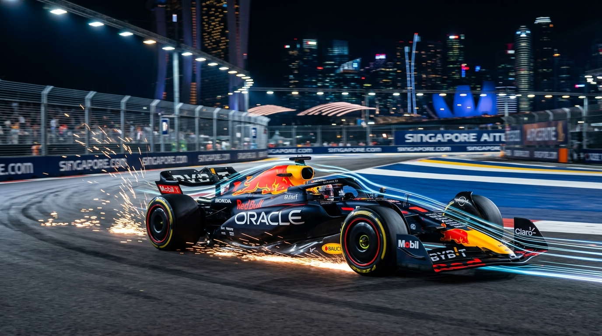

<div align="center">

<!-- Hero Banner: Red Bull RB19 / Telemetry Concept -->


<br/>

<p align="center">
  
</p>

</div>

### 🏎️ Paddock Briefing // Overview

> *"Simply Lovely."* — Engineering software with mechanical sympathy, optimizing for low latency, deterministic execution, and distributed scalability.

- 🇧🇷 **Undergraduate Engineer** based in Brazil.
- ⚡ **Specialization**: Low-Level Engineering, Applied AI/ML, Embedded Architecture, and High-Throughput Distributed Systems.
- 🎯 **Engineering Philosophy**: Squeezing every nanosecond and clock cycle out of silicon, treating computing resources like aerodynamic surfaces under extreme racing load.

<br/>

<div align="center">
  <!-- Core Pillars Telemetry Card -->
  
</div>

<br/>

---

### 🛠️ Technical Arsenal // Telemetry Readout

```yaml
Languages:       [ Rust, C, Python, SQL, Java ]
Engines & OS:    [ Linux, Docker, QEMU, Git ]
Specializations: [ Low-Level Computing, Applied AI/ML, Embedded Systems, Distributed Backends ]
Target Metric:   [ Sub-millisecond Latency, Mechanical Sympathy, Zero Overhead ]
```

<div align="center">

| Chassis & Power Unit | Control Systems & ML | Infrastructure & Telemetry |
| :--- | :--- | :--- |
| `Rust` `C` `Linux Kernel` | `Python` `PyTorch` `AI Agents` | `Docker` `QEMU` `Git` `SQL` |
| Low-level systems, bare-metal & memory safety | Applied machine intelligence & inference pipelines | Containerization, emulation & distributed architectures |

</div>

<br/>

<p align="center">
  
</p>

### 🏁 Vehicle Telemetry // RB19 Aerodynamics & Performance

<div align="center">
  
</div>

<br/>

<div align="center">
  
  <p align="center">
    <sub><em>Oracle Red Bull Racing RB19 • Pushing limits under Singapore floodlights • High downforce &amp; maximum aerodynamic efficiency</em></sub>
  </p>
</div>

<br/>

---

### ⏱️ Timing Board // GitHub Stats

<div align="center">
  
</div>

<br/>

<div align="center">
  
  &nbsp;&nbsp;
  
</div>

<br/>

<p align="center">
  
</p>

### 📻 Pit Wall Radio // Contact & Comms

<div align="center">

```
[RADIO COMMS]: "Box this lap, let's talk high-performance systems and interesting engineering challenges."
```

**Direct Telemetry**: [`guilhermebarb0sa@proton.me`](mailto:guilhermebarb0sa@proton.me) • **GitHub**: [`@pedrozaz`](https://github.com/pedrozaz)

<br/>

<sub>🏁 <em>Delta: -0.334s • Purple Sectors • Built for speed and precision</em> 🏁</sub>

</div>
