  

## About

Computer Engineering student focused on **Rust, low-level systems, and machine learning**. I enjoy working close to memory, concurrency, and performance, then carrying those ideas upward into distributed backends and applied AI.

Currently working in Artificial Intelligence R&D, building systems for real-world problems.

**Open to:** projects and research opportunities.
